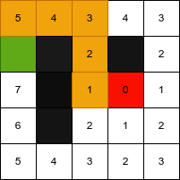

# A\*

## Goal

This algo is used to find the shortest way to reach one point to another.

## Explanation

In the image above, the red is the starting tile and the green is the ending tile.

https://www.kodeco.com/3016-introduction-to-a-pathfinding
