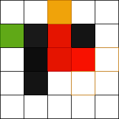

# A\*

## Goal

This algo is used to find the shortest way to reach one point to another.

## Explanation

In this image, the red is the starting tile and the green is the ending tile.


Everytime a new tile will need to be analize, we will put the tile in our array `openTiles`. At initialization, the starting tile will be place in the array.

```js
openTiles.push(startTile);
```

Every tile placed in the `openTiles` array will be marked as visited for not going over the same tile twice.

Once done the process can start, the goal is to search first for the accessible tile neighboring our starting tile.

```js
const adjacentTiles = this.getAdjacentTiles(currentTile.x, currentTile.y);
```


In the example above, we have 3 of them. For each of them, we will calculate the h, g and f score.

In my example, the h score is simply the manhatan distance between the tile and the end tile. If I calculate the manhantan distance for each of the tile, the result will be this:


So in our case, our 3 tiles has the following h score.

```js
adjacentTile.h = this.manhattan(adjacentTile, endTile);
```


Now, let's calculate the g score. In my scenario, every tile has a cost of 1 but we could imagine tiles with different cost such as crossing mountain could cost 3 while a plain could cost only 1.

```js
const gScore = currentTile.g + adjacentTile.cost;
```


Finally, we can calculate the f score for each tile, which is just the sum of the h and g scores.


Then, we choose the tile with the smallest f score.

```js
currentTile = openTiles.reduce(
  (best, current) => (best && best.f < current.f ? best : current),
  openTiles[0]
);
```

And we repeat the same process


Again and again



Until we find the ending tile

```js
if (currentTile.x === xEnd && currentTile.y === yEnd) {
    hasPath = true;
    break;
}
```


## How does it work when the algo choose a wrong path?

This is not a problem, all the tiles visited are keeped in the `openTiles` array. In case of a dead end, the path will be marked has visited but we will continue look for a path from the openTiles remaining.

## Links

[https://www.kodeco.com/3016-introduction-to-a-pathfinding](https://www.kodeco.com/3016-introduction-to-a-pathfinding)
